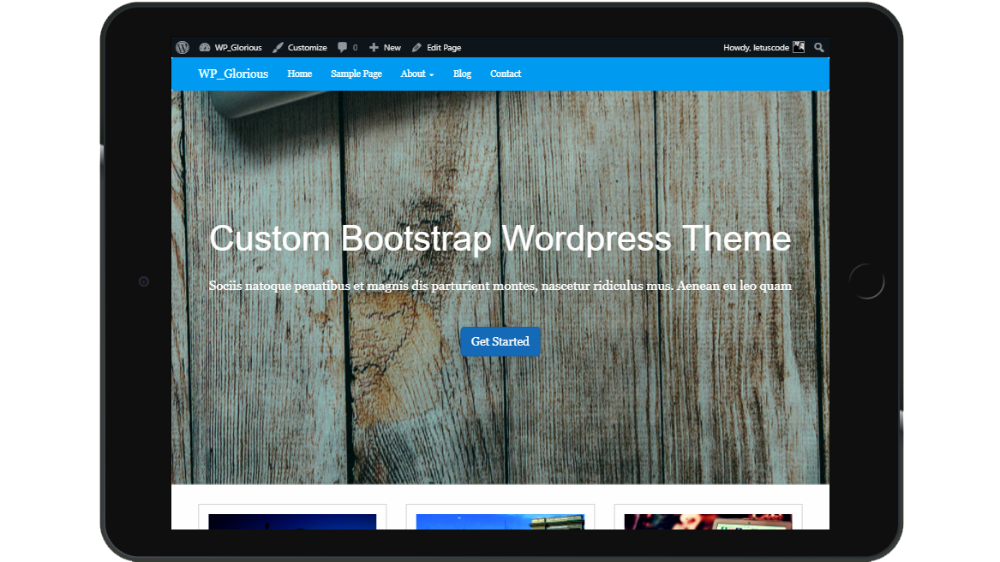
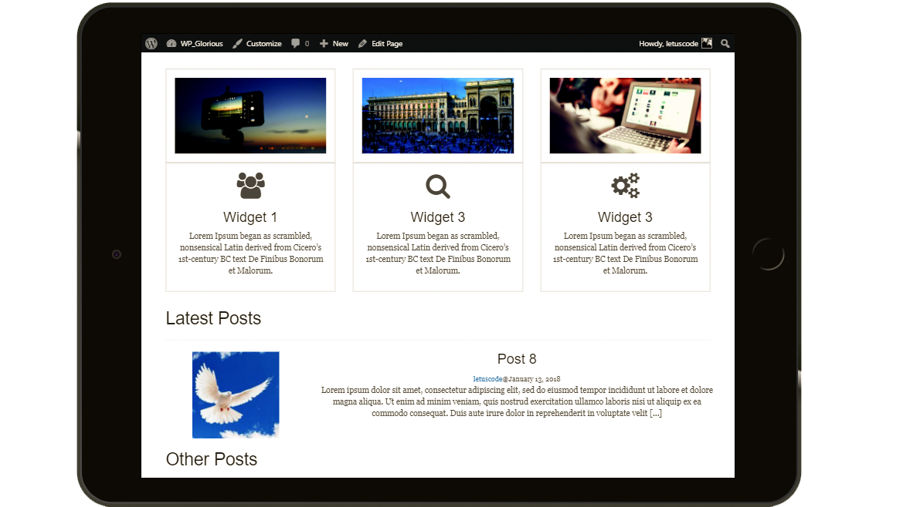

## Wordpress Example Starter Code

```
> git clone
> cd
> add code to htdocs folder
> start Apache Server
> open localhost for development
```

## Project View




### Key Features

> Enqueue Scripts for js and css

> Custom Menus

> Post Loop

> Custom and specialized page templates

> Add Theme Support

> Create Post Formats

> Sidebars and Widgets

> Query Posts with WP_Query

> Comments Template

> HTML5 addition to forms

> Custom search bar using bootstrap

> Walker Class for Bootstrap menu

> Outputing Blog Info

> Custom Post Types

> Pagination

## Links

[Wordpress Developers Handbook](https://developer.wordpress.org/themes/)

[Wordpress Loop](https://developer.wordpress.org/themes/basics/the-loop/)

```php
<?php if ( have_posts() ) : ?>
    <?php while ( have_posts() ) : the_post(); ?>
        ... Display post content
    <?php endwhile; ?>
<?php endif; ?>
```

#### The loop can display

> **next_post_link()** – a link to the post published chronologically after the current post

> **previous_post_link()** – a link to the post published chronologically before the current post

> **the_category()** – the category or categories associated with the post or page being viewed

> **the_author()** – the author of the post or page

> **the_content()** – the main content for a post or page

> **the_excerpt()** – the first 55 words of a post’s main content followed by an ellipsis (…) or read more link that goes to the full post. You may also use the “Excerpt” field of a post to customize the length of a particular excerpt.

> **the_ID()** – the ID for the post or page

> **the_meta()** – the custom fields associated with the post or page

> **the_shortlink()** – a link to the page or post using the url of the site and the ID of the post or page

> **the_tags()** – the tag or tags associated with the post

> **the_title()** – the title of the post or page

> **the_time()** – the time or date for the post or page. This can be customized using standard php date function formatting.

#### Conditional tags

> **is_home()** – Returns true if the current page is the homepage

> **is_admin()** – Returns true if inside Administration Screen, false otherwise

> **is_single()** – Returns true if the page is currently displaying a single post

> **is_page()** – Returns true if the page is currently displaying a single page

> **is_page_template()** – Can be used to determine if a page is using a specific template, for example: is_page_template('about-page.php')

> **is_category()** – Returns true if page or post has the specified category, for example: is_category('news')

> **is_tag()** – Returns true if a page or post has the specified tag

> **is_author()** – Returns true if inside author’s archive page

> **is_search()** – Returns true if the current page is a search results page

> **is_404()** – Returns true if the current page does not exist

> **has_excerpt()** – Returns true if the post or page has an excerpt

## Example Loops

### Blog

```php
<?php if ( have_posts() ) : while ( have_posts() ) : the_post(); ?>

        <h2><?php the_title(); ?></h2>
    <?php the_post_thumbnail(); ?>
    <?php the_excerpt(); ?>
<?php endwhile; else: ?>
    <?php _e( 'Sorry, no posts matched your criteria.', 'textdomain' ); ?>
<?php endif; ?>
```

### Conditional loop

```php
// Start the Loop.
<?php if ( have_posts() ) : while ( have_posts() ) : the_post();
/* * See if the current post is in category 3.
   * If it is, the div is given the CSS class "post-category-three".
   * Otherwise, the div is given the CSS class "post".
*/
if ( in_category( 3 ) ) : ?>

<div class="post-category-three">
    <?php else : ?>
<div class="post">
    <?php endif; ?>

        // Display the post's title.
        <h2><?php the_title() ?></h2>

        // Display a link to other posts by this posts author.
        <small><?php _e( 'Posted by ', 'textdomain' ); the_author_posts_link() ?></small>

        // Display the post's content in a div.
        <div class="entry">
            <?php the_content() ?>
        </div>

        // Display a comma separated list of the post's categories.
        <?php _e( 'Posted in ', 'textdomain' ); the_category( ', ' ); ?>

    // closes the first div box with the class of "post" or "post-cat-three"
    </div>

// Stop the Loop, but allow for a "if not posts" situation
<?php endwhile; else :
/*
 * The very first "if" tested to see if there were any posts to
 * display. This "else" part tells what do if there weren't any.
 */
_e( 'Sorry, no posts matched your criteria.', 'textdomain' );
 // Completely stop the Loop.
 endif;
?>
```
